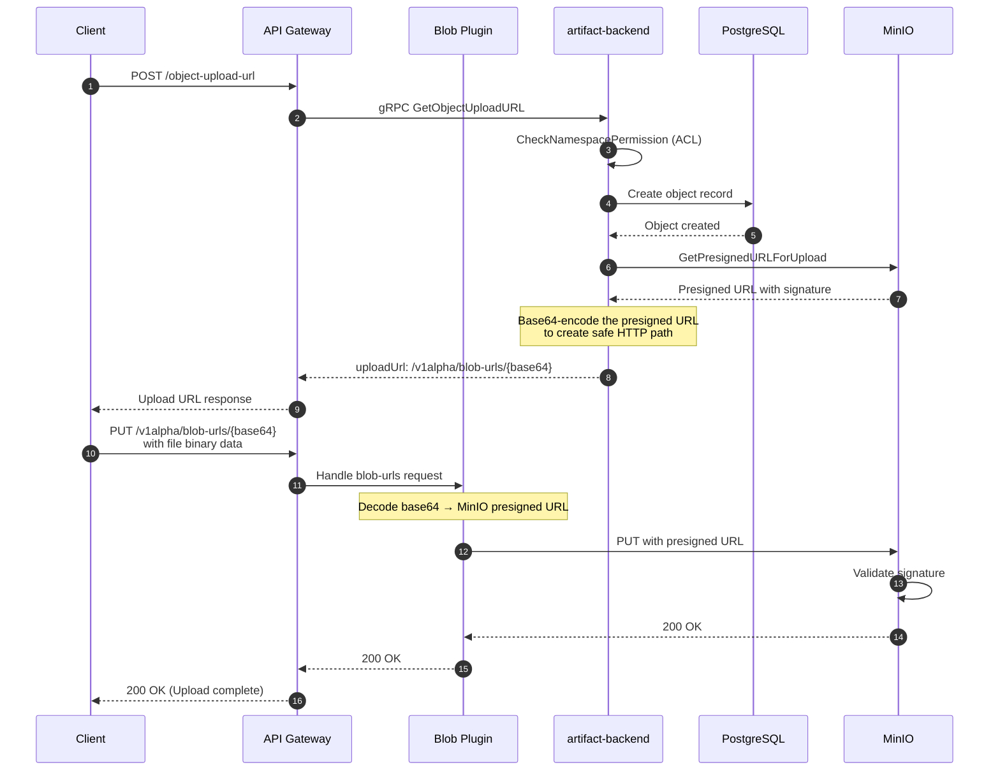
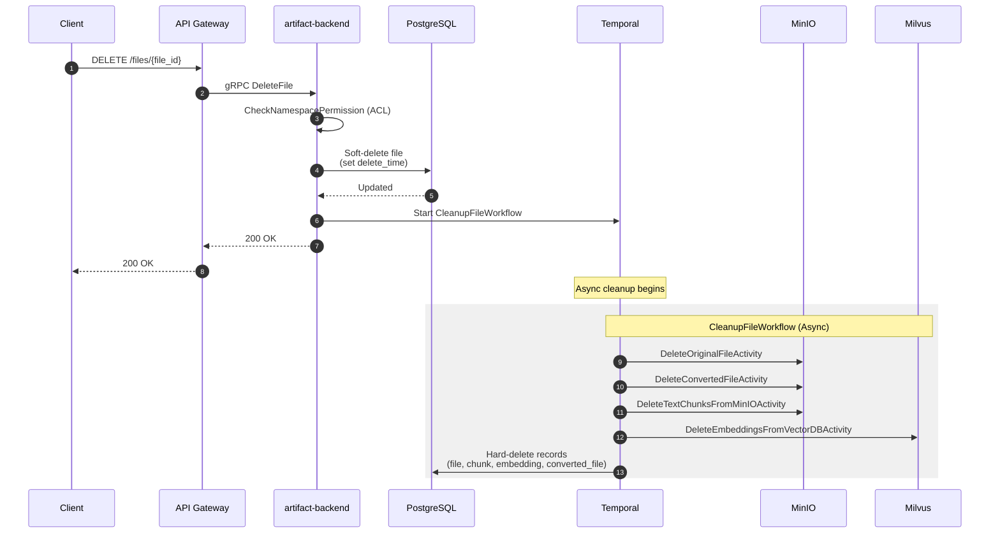
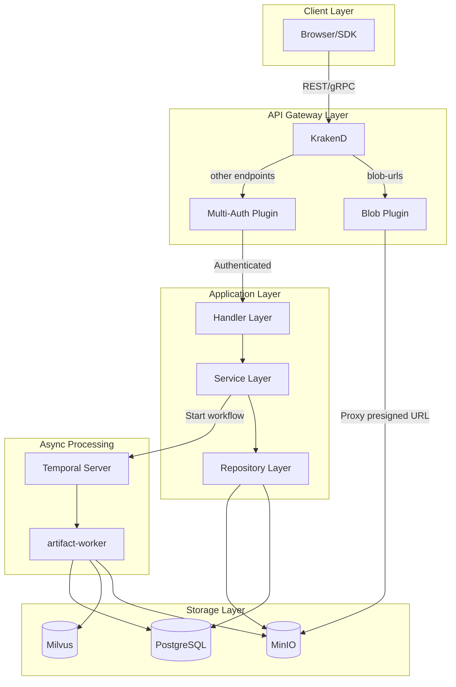

# Blob Storage Architecture

This document describes how file uploading and deletion works in artifact-backend, including the interaction with the API Gateway's blob plugin and MinIO object storage.

## Overview

The artifact-backend uses a **presigned URL pattern** for file uploads, which allows clients to upload files directly to MinIO without the file data passing through the application server. This improves performance and reduces server load.

## Components

| Component | Role |
|-----------|------|
| **API Gateway (KrakenD)** | Routes requests, hosts the blob plugin for proxying presigned URLs |
| **Blob Plugin** | Decodes base64-encoded presigned URLs and proxies requests to MinIO |
| **artifact-backend** | Generates presigned URLs, manages metadata in PostgreSQL |
| **MinIO** | Object storage for files (original, converted, chunks) |
| **PostgreSQL** | Stores metadata (object, file, chunk, embedding records) |
| **Milvus** | Vector database for embeddings (used in semantic search) |
| **Temporal** | Workflow orchestration for async processing and cleanup |

## File Upload Flow



### Why Base64 Encoding?

The MinIO presigned URL contains special characters (query parameters with signatures like `X-Amz-Signature`). Base64 encoding ensures:

- Safe transport through HTTP path segments
- No URL encoding issues with KrakenD routing
- The blob plugin can cleanly decode and proxy to MinIO

### Why No Namespace in `/v1alpha/blob-urls/{base64}`?

The presigned URL is a **self-contained authorization token**. When `GetObjectUploadURL` is called:

1. **Authorization happens at that point** - the user's permission to upload to the namespace is verified
2. **The namespace is embedded in the URL** - the object path contains `ns-{namespaceUID}/obj-{objectUID}`
3. **The signature proves authorization** - MinIO validates that artifact-backend authorized this specific operation

The blob plugin acts as a "dumb proxy" - it doesn't need to re-verify permissions because the presigned URL already encapsulates the authorization.

## File Deletion Flow

File deletion is a two-phase process: immediate soft-delete followed by asynchronous cleanup via Temporal workflows.



### Cleanup Activities

| Activity | Description |
|----------|-------------|
| `DeleteOriginalFileActivity` | Removes the original uploaded file from MinIO |
| `DeleteConvertedFileActivity` | Removes converted markdown files from MinIO |
| `DeleteTextChunksFromMinIOActivity` | Removes text chunk files from MinIO |
| `DeleteEmbeddingsFromVectorDBActivity` | Removes vector embeddings from Milvus |
| Hard-delete DB records | Permanently removes metadata from PostgreSQL |

## MinIO Storage Path Convention

```
instill-ai-artifact/                          # Bucket
├── ns-{namespaceUID}/                        # Namespace-scoped objects
│   └── obj-{objectUID}                       # Original uploaded object
│
└── kb-{kbUID}/                               # Knowledge base-scoped files
    └── file-{fileUID}/
        ├── converted/
        │   └── {type}.md                     # Converted markdown
        └── chunks/
            └── {chunkUID}.txt                # Text chunks
```

## Component Architecture



## Data Flow Summary

### Upload Path

1. Client requests upload URL → artifact-backend validates permissions and creates metadata
2. artifact-backend generates presigned URL from MinIO
3. artifact-backend base64-encodes URL and returns to client
4. Client uploads directly to `/v1alpha/blob-urls/{base64}`
5. Blob plugin decodes and proxies to MinIO

### Deletion Path

1. Client requests deletion → artifact-backend validates permissions
2. artifact-backend soft-deletes record (sets `delete_time`)
3. artifact-backend triggers Temporal workflow for async cleanup
4. Worker cleans up all resources (MinIO files, Milvus embeddings, DB records)

## Security Considerations

- **Presigned URLs have expiration** - Default 1-7 days, configurable per request
- **Authorization is front-loaded** - Permission check happens when generating the presigned URL
- **Signatures are cryptographically secure** - MinIO validates the signature before allowing operations
- **No sensitive data in URL path** - The base64-encoded URL is opaque to observers
