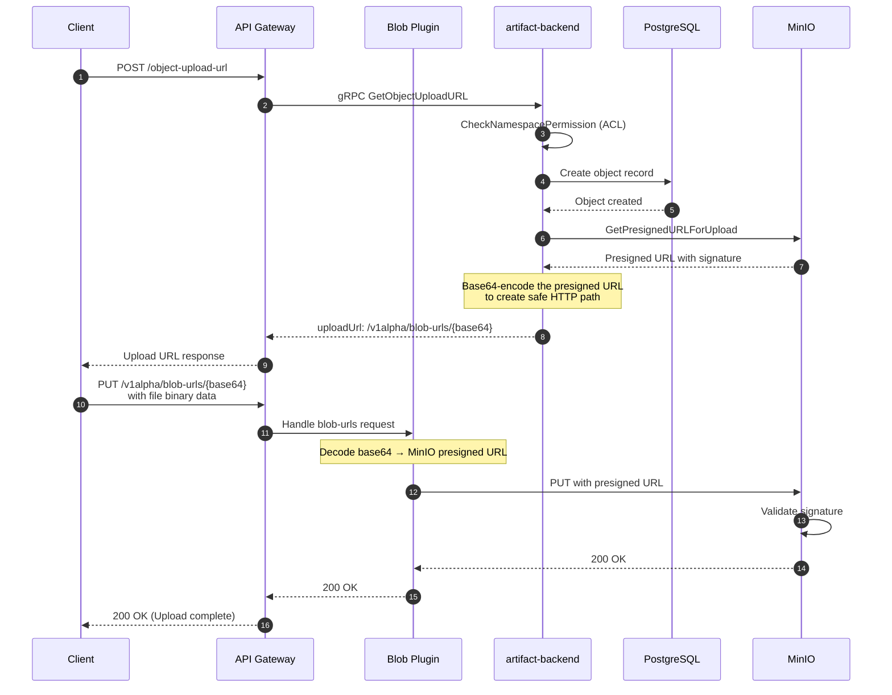
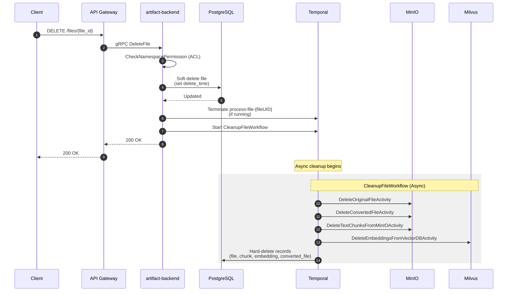
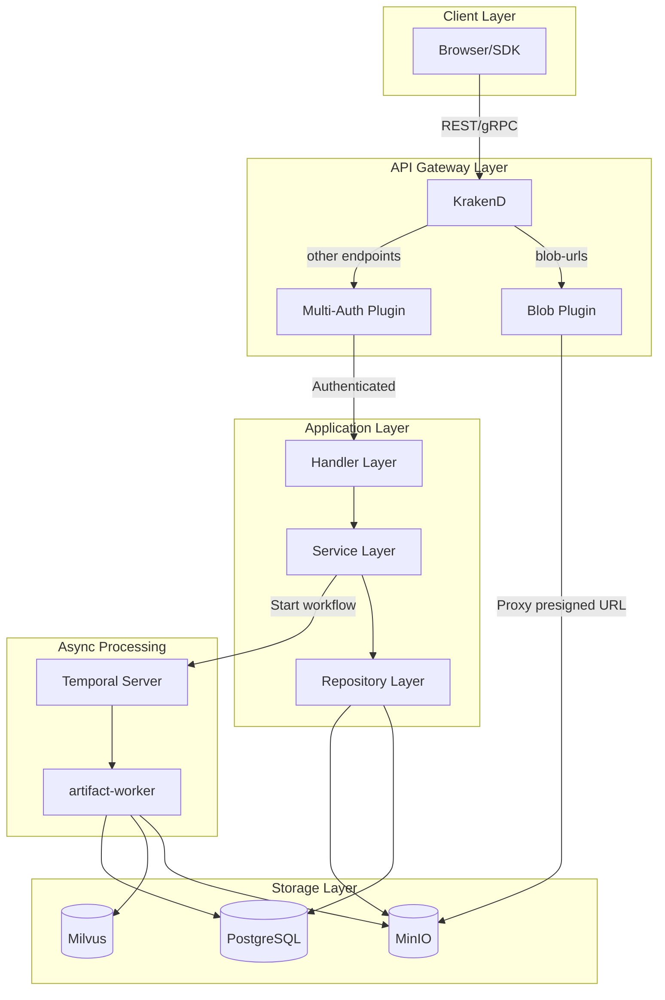

# Blob Storage Architecture

This document describes how file uploading and deletion works in artifact-backend, including the interaction with the API Gateway's blob plugin and MinIO object storage.

## Overview

The artifact-backend uses a **presigned URL pattern** for file uploads, which allows clients to upload files directly to MinIO without the file data passing through the application server. This improves performance and reduces server load.

## Components

| Component | Role |
|-----------|------|
| **API Gateway (KrakenD)** | Routes requests, hosts the blob plugin for proxying presigned URLs |
| **Blob Plugin** | Decodes base64-encoded presigned URLs and proxies requests to MinIO |
| **artifact-backend** | Generates presigned URLs, manages metadata in PostgreSQL |
| **MinIO** | Object storage for files (original, converted, chunks) |
| **PostgreSQL** | Stores metadata (object, file, chunk, embedding records) |
| **Milvus** | Vector database for embeddings (used in semantic search) |
| **Temporal** | Workflow orchestration for async processing and cleanup |

## File Upload Flow


```mermaid
sequenceDiagram
    autonumber
    participant Client
    participant APIGateway as API Gateway
    participant BlobPlugin as Blob Plugin
    participant ArtifactBackend as artifact-backend
    participant PostgreSQL
    participant MinIO

    Client->>APIGateway: POST /object-upload-url
    APIGateway->>ArtifactBackend: gRPC GetObjectUploadURL
    ArtifactBackend->>ArtifactBackend: CheckNamespacePermission (ACL)
    ArtifactBackend->>PostgreSQL: Create object record
    PostgreSQL-->>ArtifactBackend: Object created
    ArtifactBackend->>MinIO: GetPresignedURLForUpload
    MinIO-->>ArtifactBackend: Presigned URL with signature

    Note over ArtifactBackend: Base64-encode the presigned URL<br/>to create safe HTTP path

    ArtifactBackend-->>APIGateway: uploadUrl: /v1alpha/blob-urls/{base64}
    APIGateway-->>Client: Upload URL response

    Client->>APIGateway: PUT /v1alpha/blob-urls/{base64}<br/>with file binary data
    APIGateway->>BlobPlugin: Handle blob-urls request

    Note over BlobPlugin: Decode base64 → MinIO presigned URL

    BlobPlugin->>MinIO: PUT with presigned URL
    MinIO->>MinIO: Validate signature
    MinIO-->>BlobPlugin: 200 OK
    BlobPlugin-->>APIGateway: 200 OK
    APIGateway-->>Client: 200 OK (Upload complete)
```

### Why Base64 Encoding?

The MinIO presigned URL contains special characters (query parameters with signatures like `X-Amz-Signature`). Base64 encoding ensures:

- Safe transport through HTTP path segments
- No URL encoding issues with KrakenD routing
- The blob plugin can cleanly decode and proxy to MinIO

### Why No Namespace in `/v1alpha/blob-urls/{base64}`?

The presigned URL is a **self-contained authorization token**. When `GetObjectUploadURL` is called:

1. **Authorization happens at that point** - the user's permission to upload to the namespace is verified
2. **The namespace is embedded in the URL** - the object path contains `ns-{namespaceUID}/obj-{objectUID}`
3. **The signature proves authorization** - MinIO validates that artifact-backend authorized this specific operation

The blob plugin acts as a "dumb proxy" - it doesn't need to re-verify permissions because the presigned URL already encapsulates the authorization.

## File Deletion Flow

File deletion is a three-phase process: immediate soft-delete, termination of any in-flight processing workflow, then asynchronous cleanup via Temporal workflows.


```mermaid
sequenceDiagram
    autonumber
    participant Client
    participant APIGateway as API Gateway
    participant ArtifactBackend as artifact-backend
    participant PostgreSQL
    participant Temporal
    participant MinIO
    participant Milvus

    Client->>APIGateway: DELETE /files/{file_id}
    APIGateway->>ArtifactBackend: gRPC DeleteFile
    ArtifactBackend->>ArtifactBackend: CheckNamespacePermission (ACL)
    ArtifactBackend->>PostgreSQL: Soft-delete file<br/>(set delete_time)
    PostgreSQL-->>ArtifactBackend: Updated
    ArtifactBackend->>Temporal: Terminate process-file-{fileUID}<br/>(if running)
    ArtifactBackend->>Temporal: Start CleanupFileWorkflow
    ArtifactBackend-->>APIGateway: 200 OK
    APIGateway-->>Client: 200 OK

    Note over Temporal: Async cleanup begins

    rect rgb(240, 240, 240)
        Note over Temporal,Milvus: CleanupFileWorkflow (Async)
        Temporal->>MinIO: DeleteOriginalFileActivity
        Temporal->>MinIO: DeleteConvertedFileActivity
        Temporal->>MinIO: DeleteTextChunksFromMinIOActivity
        Temporal->>Milvus: DeleteEmbeddingsFromVectorDBActivity
        Temporal->>PostgreSQL: Hard-delete records<br/>(file, chunk, embedding, converted_file)
    end
```

### Processing Workflow Termination

When `CleanupFile` is called, it first terminates any running `process-file-{fileUID}` workflow before starting the cleanup workflow. This prevents:

- **Wasted compute**: The processing workflow would continue chunking, embedding, and summarizing a deleted file.
- **Silent DB failures**: Processing activities use `WHERE delete_time IS NULL` in their updates. After soft-delete, these updates silently find 0 rows, leaving `process_status` stuck at `PROCESSING`.
- **Conflicting operations**: Cleanup and processing workflows operating on the same file's resources concurrently.

### Cleanup Activities

| Activity | Description |
|----------|-------------|
| `DeleteOriginalFileActivity` | Removes the original uploaded file from MinIO |
| `DeleteConvertedFileActivity` | Removes converted markdown files from MinIO |
| `DeleteTextChunksFromMinIOActivity` | Removes text chunk files from MinIO |
| `DeleteEmbeddingsFromVectorDBActivity` | Removes vector embeddings from Milvus |
| Hard-delete DB records | Permanently removes metadata from PostgreSQL |

## MinIO Storage Path Convention

```
instill-ai-artifact/                          # Bucket
├── ns-{namespaceUID}/                        # Namespace-scoped objects
│   └── obj-{objectUID}                       # Original uploaded object
│
└── kb-{kbUID}/                               # Knowledge base-scoped files
    └── file-{fileUID}/
        ├── converted/
        │   └── {type}.md                     # Converted markdown
        └── chunks/
            └── {chunkUID}.txt                # Text chunks
```

## Component Architecture


```mermaid
graph TB
    subgraph "Client Layer"
        Browser[Browser/SDK]
    end

    subgraph "API Gateway Layer"
        KrakenD[KrakenD]
        BlobPlugin[Blob Plugin]
        MultiAuth[Multi-Auth Plugin]
    end

    subgraph "Application Layer"
        Handler[Handler Layer]
        Service[Service Layer]
        Repository[Repository Layer]
    end

    subgraph "Async Processing"
        Temporal[Temporal Server]
        Worker[artifact-worker]
    end

    subgraph "Storage Layer"
        PostgreSQL[(PostgreSQL)]
        MinIO[(MinIO)]
        Milvus[(Milvus)]
    end

    Browser -->|REST/gRPC| KrakenD
    KrakenD -->|blob-urls| BlobPlugin
    KrakenD -->|other endpoints| MultiAuth
    BlobPlugin -->|Proxy presigned URL| MinIO
    MultiAuth -->|Authenticated| Handler

    Handler --> Service
    Service --> Repository
    Repository --> PostgreSQL
    Repository --> MinIO

    Service -->|Start workflow| Temporal
    Temporal --> Worker
    Worker --> MinIO
    Worker --> Milvus
    Worker --> PostgreSQL
```

## Data Flow Summary

### Upload Path

1. Client requests upload URL → artifact-backend validates permissions and creates metadata
2. artifact-backend generates presigned URL from MinIO
3. artifact-backend base64-encodes URL and returns to client
4. Client uploads directly to `/v1alpha/blob-urls/{base64}`
5. Blob plugin decodes and proxies to MinIO

### Deletion Path

1. Client requests deletion → artifact-backend validates permissions
2. artifact-backend soft-deletes record (sets `delete_time`)
3. artifact-backend triggers Temporal workflow for async cleanup
4. Worker cleans up all resources (MinIO files, Milvus embeddings, DB records)

### Range / partial-content support

`/v1alpha/blob-urls/...` is a transparent byte-proxy to MinIO, so HTTP
`Range` and conditional-request semantics flow end-to-end:

- The api-gateway `blob` plugin forwards `Range`, `If-Range`,
  `If-None-Match`, and `If-Modified-Since` onto the upstream MinIO
  request. MinIO answers `206 Partial Content` with a valid
  `Content-Range` for byte-range requests and `304 Not Modified` for
  matching validators.
- The 24 h `Cache-Control: public, max-age=86400` directive added in
  object-ID mode is scoped to `200 OK` responses only. `206` and `304`
  responses intentionally do **not** receive that directive: a partial
  body must never be cached as if it were the whole object, and `304`
  already relies on the validator attached to the original `200`.

Consequences for consumers:

- Browser `<video>` / `<audio>` elements seeking via `fastSeek()` issue
  `Range` requests; a multi-hundred-MB citation video jumps to the
  requested offset without re-streaming the whole object.
- HTTP caches (browser, Cloudflare) can revalidate long-lived
  `derivedResourceUri` responses cheaply via `If-None-Match`.

This contract is guarded by `api-gateway/plugins/blob/main_test.go`
(invariant `BLOB-INV-RANGE` — see `api-gateway/AGENTS.md`).

## Security Considerations

- **Presigned URLs have expiration** - Default 1-7 days, configurable per request
- **Authorization is front-loaded** - Permission check happens when generating the presigned URL
- **Signatures are cryptographically secure** - MinIO validates the signature before allowing operations
- **No sensitive data in URL path** - The base64-encoded URL is opaque to observers

## `ListFiles` fan-out presign (`view` parameter)

`ListFilesRequest.view` (added in the Files card preview optimization plan,
Phase 2b) lets callers request a content view on a list response. When set,
`PublicHandler.ListFiles` delegates per-row URL resolution to the shared
`resolveDerivedResourceURI` helper — the same code path as `GetFile` — and
fans out the per-row presigns through an `errgroup` with **bounded
concurrency (16 workers)**. Each file gets its own MinIO HMAC computed in
parallel; per-row errors are logged at `warn` level and surface as an
empty `File.derived_resource_uri` instead of failing the whole list call.
The following contract is intentional and must be preserved:

- `File.derived_resource_uri` is **only** populated when the client
  explicitly passes `view`. A list call without `view` returns the
  legacy metadata-only response to keep cheap listings cheap.
- `File.thumbnail_uri` is orthogonal to `view`: when a
  `CONVERTED_FILE_TYPE_THUMBNAIL` row exists it is emitted on every
  response regardless of the requested view. Resolution is handled by
  `resolveThumbnailURI(ctx, kbFile)` in `pkg/handler/file.go`, which
  generates a 15-minute MinIO presign for the thumbnail's
  `storage_path` and encodes it through `service.EncodeBlobURL` so the
  final URL routes through `/v1alpha/blob-urls/...` and is
  Cloudflare-cacheable. The helper is invoked from both single-file
  `GetFile` and from the `ListFiles` view fan-out — see
  `ARTIFACT-INV-THUMBNAIL-URI-RESOLUTION`. All failure modes are
  non-fatal (missing row, presign error, encoding error); the frontend
  falls back through `derived_resource_uri` to the mime icon.
- `ListFilesAdminRequest.view` mirrors the public field so internal
  callers can opt into the same fan-out without having to re-presign
  in their own service.

Acceptance gates live with the service-level k6 regression tests in
`integration-test/` — they upload the minimum file set needed to
exercise the view fan-out end-to-end and assert that
`derivedResourceUri` is populated on every row and that
`thumbnail_uri` routes through `/v1alpha/blob-urls/...` for image and
video rows while remaining absent for non-thumbnailable types (see
`ARTIFACT-INV-LIST-VIEW-FANOUT` and
`ARTIFACT-INV-THUMBNAIL-NON-BLOCKING` in `AGENTS.md`).

> **`view` propagation gotcha (Phase 2b regression, fixed April 2026):**
> The `view` query parameter must survive *every* hop from the browser to
> this handler for Phase 2b fan-out to trigger. A stale gateway query-
> string allow-list silently dropped `"view"` at the edge once and made
> the Files page render as if every row were a non-standardizable type.
> The contract callers downstream of CE must uphold:
>
> 1. Any reverse-proxy / API-gateway query-string allow-list in front of
>    `GET /v1alpha/namespaces/{namespace_id}/files` MUST include
>    `"view"`. If the allow-list is rendered from a higher-level config
>    file, re-render and reload the gateway whenever the list endpoint's
>    allow-list changes.
> 2. Any intermediate admin / S2S handler that re-issues `ListFiles`
>    against this service MUST forward `req.View` (including the unset
>    sentinel) to `ListFilesAdmin` verbatim — never zero it out in the
>    translation layer.
> 3. The CE regression `integration-test/rest-file-type.js` (the per-type
>    group) calls `ListFiles(view=VIEW_STANDARD_FILE_TYPE)` and asserts
>    that `derivedResourceUri` is non-empty for the standardizable row —
>    this is the CE-side canary that catches a dropped `view` at the
>    grpc-gateway/client translation hop. Downstream consumers SHOULD pin
>    an analogous gateway-level assertion in their own test surface.
