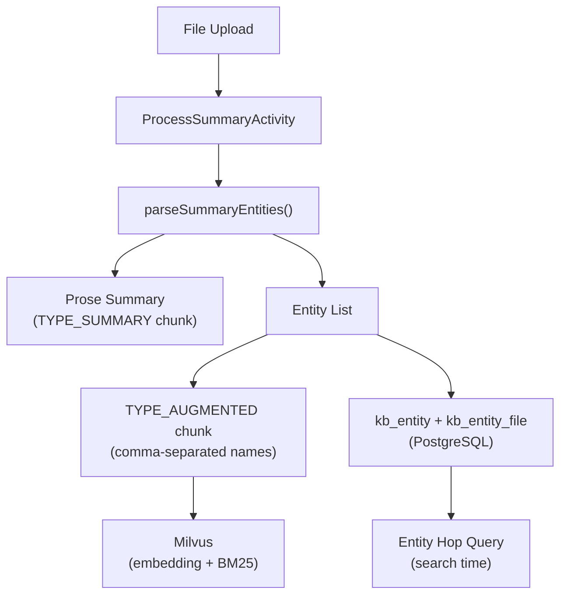

# Entity Graph

This document describes the entity extraction pipeline and cross-file linking mechanism.

## Architecture



## Schema

### `kb_entity`

| Column | Type | Description |
|--------|------|-------------|
| `uid` | UUID (PK) | Auto-generated |
| `kb_uid` | UUID (FK → knowledge_base) | Knowledge base scope |
| `name` | TEXT | Canonical entity name |
| `entity_type` | TEXT | person, organization, concept, technology, event, work, place, product |

**Unique constraint**: `(kb_uid, name)` — one canonical entity per KB.

### `kb_entity_file`

| Column | Type | Description |
|--------|------|-------------|
| `entity_uid` | UUID (FK → kb_entity) | Entity reference |
| `file_uid` | UUID (FK → file) | File reference |

**Primary key**: `(entity_uid, file_uid)` — junction table.

## Extraction Flow

1. `ProcessSummaryActivity` calls Gemini with the enhanced prompt (`rag_generate_summary.md`)
2. Gemini returns structured output with `## Summary` and `## Entities` sections
3. `parseSummaryEntities()` splits the output into prose summary and entity list
4. Prose → `TYPE_SUMMARY` chunk (existing path)
5. Entity names → comma-separated text → `TYPE_AUGMENTED` chunk (embedded + BM25 indexed)
6. Entity records → `SaveEntitiesActivity` → upsert into `kb_entity`, link via `kb_entity_file`

## Two-Phase Search Algorithm

The entity hop is exposed via the `EntityHopAdmin` private RPC and consumed by downstream search services.

1. **Phase 1 (Direct)**: `SearchChunks(TYPE_CONTENT)` — Milvus hybrid search returns top K content chunks
2. **Entity Hop**: `extractTopFileIDs()` picks top 3 file IDs → `EntityHopAdmin` RPC → SQL join on `kb_entity_file` → returns file IDs sharing entities
3. **Phase 2 (Filtered)**: `SearchChunks(TYPE_CONTENT)` filtered to entity-linked files (topK/2)
4. **Merge**: `mergeChunks()` deduplicates by chunk resource name, direct results have priority

Entity hop failures are non-fatal: search falls back to Phase 1 results only.

### Entity Hop SQL

```sql
SELECT DISTINCT ef2.file_uid
FROM kb_entity_file ef1
JOIN kb_entity_file ef2 ON ef1.entity_uid = ef2.entity_uid
WHERE ef1.file_uid IN ($topFileUIDs) AND ef2.file_uid NOT IN ($topFileUIDs)
```

### RPC

```protobuf
rpc EntityHopAdmin(EntityHopAdminRequest) returns (EntityHopAdminResponse);
```

Defined in `artifact/v1alpha/artifact_private_service.proto`. The handler resolves hash-based file IDs to UIDs, performs the SQL join, and converts back to hash-based IDs.

## Entity Types

| Type | Examples |
|------|----------|
| person | Peter Thiel, Elon Musk |
| organization | PayPal, Google, Founders Fund |
| concept | monopoly theory, network effects |
| technology | transformer architecture, CUDA |
| event | IPO, acquisition |
| work | Zero to One, The Lean Startup |
| place | Silicon Valley, Stanford |
| product | GPT-4, Gemini |

## Key Files

| File | Role |
|---|---|
| `pkg/repository/entity.go` | `EntityHop()` SQL query, upsert, link, delete |
| `pkg/handler/private.go` | `EntityHopAdmin` gRPC handler |
| `pkg/worker/process_file_workflow.go` | Entity extraction during file processing |

## Future Improvements

- **Fuzzy entity resolution**: `pg_trgm` index on `kb_entity.name` for alias matching
- **Entity embeddings**: Vector similarity for "Thiel" ≈ "Peter Thiel"
- **Entity-based UI**: Browse KB by entity, show related files
