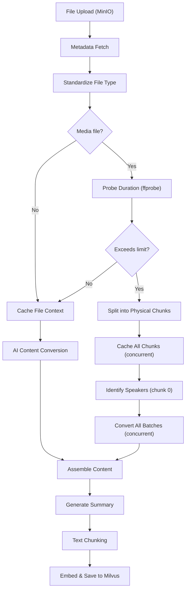
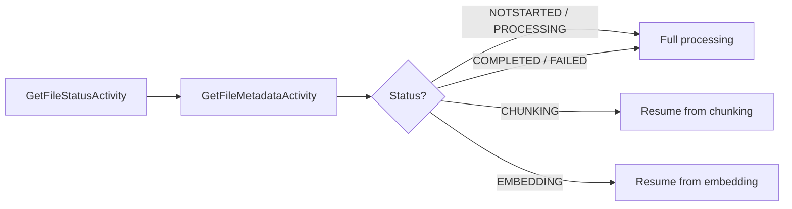
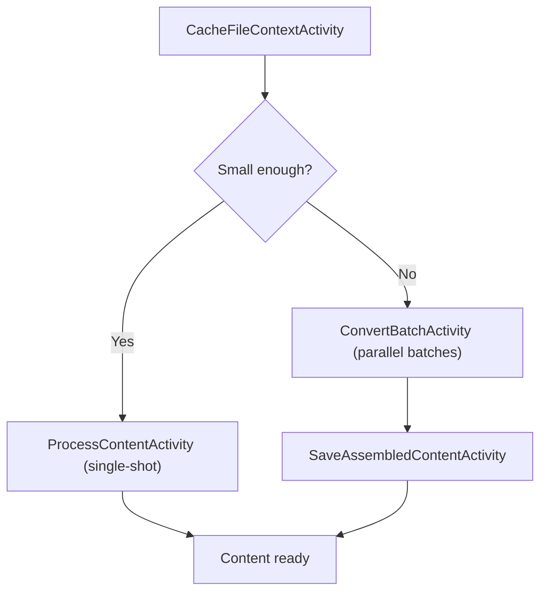
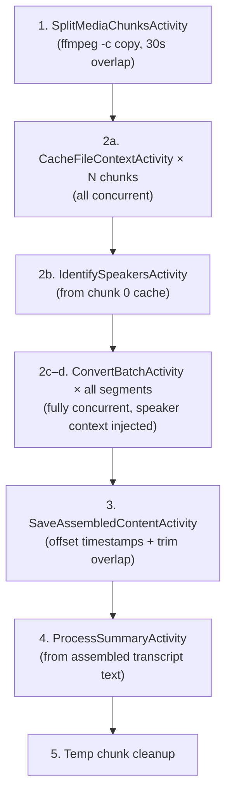

# RAG Indexing Pipeline

This document describes the end-to-end RAG (Retrieval-Augmented Generation) indexing pipeline implemented by `ProcessFileWorkflow` in artifact-backend. The pipeline transforms uploaded files into searchable, embeddable chunks stored in Milvus.

## Overview

## Components

| Component | Role |
|-----------|------|
| **Temporal** | Orchestrates the workflow as activities with retries and timeouts |
| **MinIO** | Stores original files, standardized files, converted content, and temp chunks |
| **PostgreSQL** | Tracks file metadata, processing status, converted files, and chunk records |
| **Gemini** | AI model (`gemini-3.1-pro-preview`) for multimodal content extraction, speaker identification, and summary generation |
| **Vertex AI Cache** | Caches uploaded files in Gemini context for efficient multi-batch access |
| **Milvus** | Vector database storing embeddings for semantic search |
| **ffmpeg / ffprobe** | Media duration probing and physical splitting of long media files |

## Pipeline Phases

### Phase 1: Metadata & Status Check

The workflow fetches each file's current status and metadata (file type, storage path, KB model family). Files that previously completed or failed are reprocessed from scratch. Files interrupted at chunking or embedding resume from their last checkpoint.

### Phase 2: File Type Standardization

**Activity:** `StandardizeFileTypeActivity`

Converts files to a canonical format via the `indexing-convert-file-type` pipeline:

| Input Type | Output Format |
|---|---|
| Documents (DOCX, PPTX, HTML, CSV, etc.) | PDF |
| Images (JPG, TIFF, BMP, etc.) | PNG |
| Audio (MP3, WAV, AAC, M4A, etc.) | OGG |
| Video (AVI, MOV, MKV, FLV, etc.) | MP4 |

The standardized file is always re-generated to ensure it reflects the latest conversion logic.

### Phase 3: Duration Probing (Media Only)

**Activity:** `GetMediaDurationActivity`

For media files, `ffprobe` extracts the exact duration before any AI processing. This determines whether the file takes the short (single-shot / batched) path or the long media (physical chunking) path.

| Media Type | Short Path Limit | Chunk Size |
|---|---|---|
| Video (with audio) | ≤ 30 min | 30 min per chunk |
| Audio-only | ≤ 8 hours | 8 hours per chunk |

### Phase 4: AI Content Conversion

All file types (documents, images, audio, video) use `gemini-3.1-pro-preview` for content extraction and summary generation.

#### Short Path (Documents, Images & Short Media)

1. **Cache creation** — Uploads the standardized file to Gemini's context cache.
2. **Single-shot attempt** — `ProcessContentActivity` tries to convert the entire file in one call.
3. **Batch fallback** — If the file is too large (many pages or long duration), it falls back to `ConvertBatchActivity` which processes segments in parallel, controlled by `BatchProfile`:

| File Type | Segment Size | Max Concurrent Batches |
|---|---|---|
| Documents | 10 pages | 16 |
| Video / Audio | 5 minutes | 32 |

4. **Assembly** — `SaveAssembledContentActivity` concatenates batch results, merges cross-boundary HTML tables, and uploads the final markdown.

#### Long Media Path (Concurrent Physical Chunking)

For files exceeding the duration limit, the workflow uses a fully concurrent multi-phase architecture. All chunk caches are created in parallel, then all batches across all chunks are dispatched concurrently (bounded by `MaxConcurrentBatches`).

**Phase 2a — Concurrent cache creation:** All physical chunks are uploaded to Gemini's context cache in parallel using a `workflow.Selector`. Each chunk gets its own cache entry.

**Phase 2b — Speaker identification:** `IdentifySpeakersActivity` queries chunk 0's cache with a dedicated prompt to extract speaker names (e.g., "Alice Smith, Bob Jones"). The result is formatted as a `[SPEAKER CONTEXT]` string. This ensures consistent speaker attribution across independently processed chunks — without this, later chunks would fall back to generic "Speaker 1" labels.

**Phase 2c — Batch slot building:** For each chunk, the chunk-local duration is divided into fixed-length time-range segments (e.g., 5 minutes each). All segments from all chunks are collected into a single flat batch queue.

**Phase 2d — Concurrent batch dispatch:** All batches are dispatched concurrently via a single `workflow.Selector`, bounded by `MaxConcurrentBatches`. Each `ConvertBatchActivity` call receives:
- The chunk's cache name
- Time-range boundaries (chunk-relative)
- The `SpeakerContext` string from Phase 2b

**Phase 3 — Assembly with timestamp offsetting and overlap trimming:**

`SaveAssembledContentActivity` receives a flat list of temp MinIO paths along with a `ChunkOffsets` array describing each chunk's batch count, absolute start offset, and overlap duration. During assembly:

1. **Timestamp offsetting** — `offsetTimestamps` shifts all inline timestamp tags (`[Audio: HH:MM:SS]`, `[Video: HH:MM:SS - HH:MM:SS]`) from chunk-relative to absolute time using each chunk's `Offset`.
2. **Overlap trimming** — For non-first chunks, `clipToTimeRange` removes transcript lines whose absolute timestamps fall within the overlap region already covered by the previous chunk. This eliminates duplicate content at chunk seams.
3. **Concatenation** — The trimmed, offset-adjusted batch results are concatenated into the final transcript.

**Phase 4 — Summary from transcript text:** The summary is generated from the assembled markdown text via `ContentMarkdown`, bypassing the original media file entirely. The `fileType` is overridden to `TYPE_MARKDOWN` so the AI model treats it as text input.

### Phase 5: Summary Generation

**Activity:** `ProcessSummaryActivity`

Generates a concise summary of the content. For short files with cached context, the summary reads from the Gemini cache. For long media files, the summary is generated from the assembled markdown transcript (passed as `ContentMarkdown`), with `fileType` overridden to `TYPE_MARKDOWN`.

### Phase 6: Text Chunking

**Activity:** `ChunkContentActivity`

Splits the converted markdown into overlapping text chunks for embedding. Chunk boundaries respect document structure (headings, paragraphs) where possible.

### Phase 7: Embedding & Vector Storage

**Activity:** `EmbedAndSaveChunksActivity`

Each text chunk is embedded using the KB's configured embedding model (`gemini-embedding-001` by default, 3072 dimensions), and the resulting vectors are upserted into the Milvus collection for semantic search.

## Error Handling & Resilience

- **Per-file isolation** — Each file in a batch workflow is processed independently. A single file's failure doesn't block others.
- **Retry policies** — All activities have configurable retry policies with exponential backoff. Transient errors (rate limits, deadlines) are retried automatically.
- **Cache expiration recovery** — If a Gemini cache expires mid-processing, the workflow detects `isCacheExpired` and re-creates the cache before retrying.
- **Disconnected cleanup** — Cache deletion and temp file cleanup use `workflow.NewDisconnectedContext` to ensure cleanup runs even if the parent context is cancelled.
- **Adaptive chunking** — Document batch conversion uses adaptive splitting: if page tags are missing from the AI response, it recursively bisects the range and retries.
- **Graceful speaker identification** — If `IdentifySpeakersActivity` fails or returns "UNKNOWN", the workflow proceeds without speaker context. This is non-fatal; the model will use its own labeling.
- **Long media summary isolation** — Long media files handle summary generation inside `processLongMedia`, skipping the standard summary future path in the main workflow to avoid nil-future panics.

## Key Constants

| Constant | Value | Purpose |
|---|---|---|
| `DefaultModel` | `gemini-3.1-pro-preview` | AI model for all content extraction and summary generation |
| `DefaultEmbeddingModel` | `gemini-embedding-001` | Embedding model (3072 dimensions) |
| `MaxVideoChunkDuration` | 30 min | Physical split threshold for video |
| `MaxAudioChunkDuration` | 8 hours | Physical split threshold for audio |
| `ChunkOverlap` | 30 sec | Overlap between adjacent physical chunks for boundary continuity |
| `DefaultCacheTTL` | 2 hours | Gemini context cache time-to-live |
| `RateLimitCooldown` | 60 sec | Pause before batch rounds to let API quota recover |
