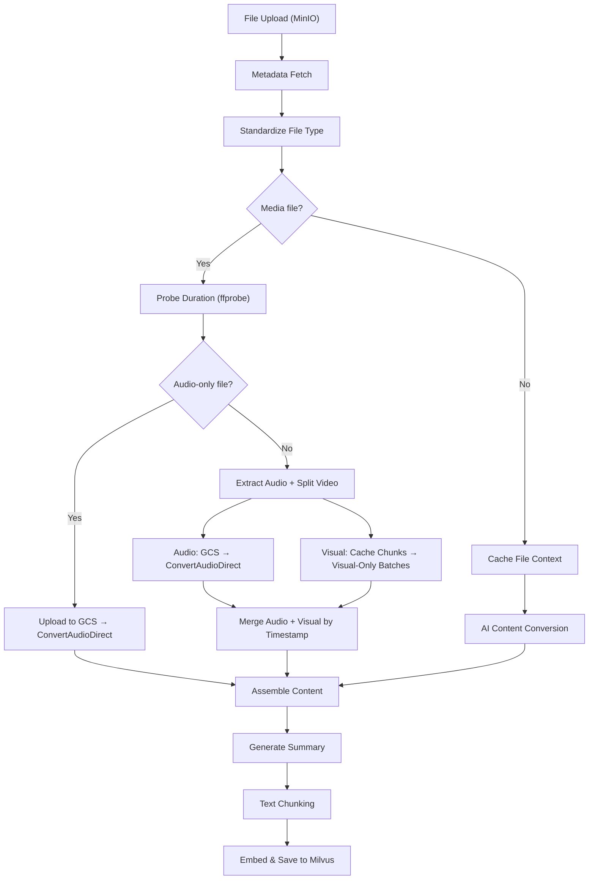
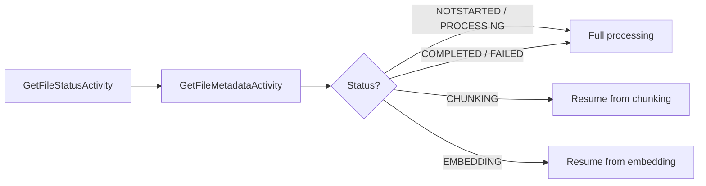
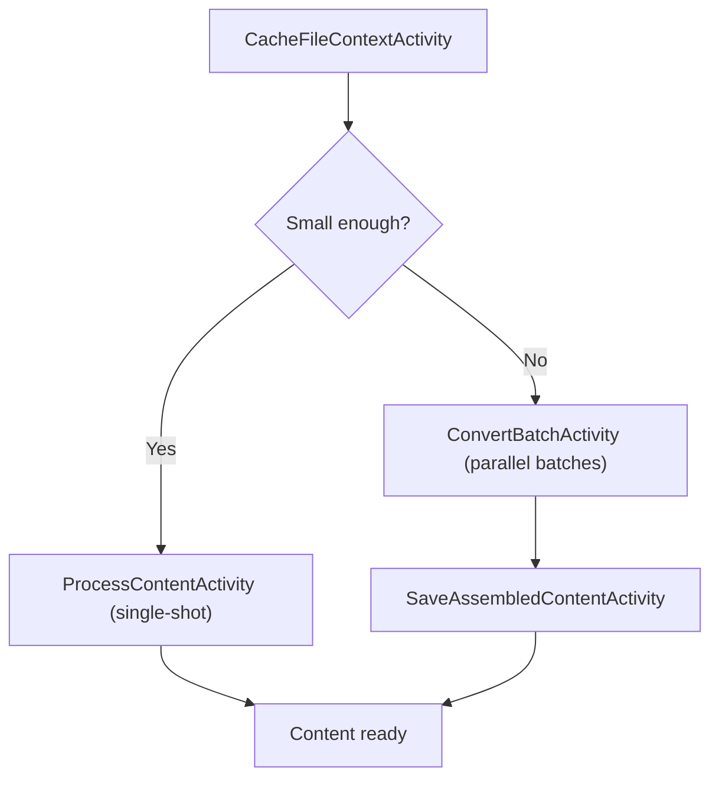
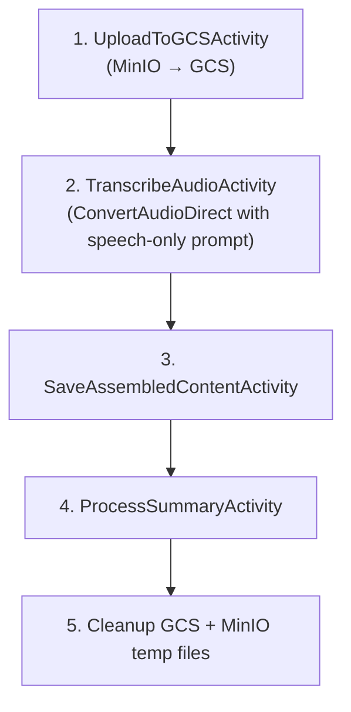
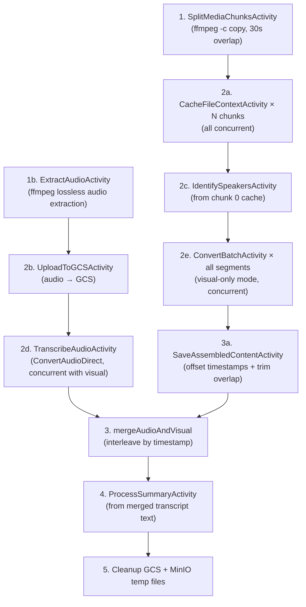

# RAG Indexing Pipeline

This document describes the end-to-end RAG (Retrieval-Augmented Generation) indexing pipeline implemented by `ProcessFileWorkflow` in artifact-backend. The pipeline transforms uploaded files into searchable, embeddable chunks stored in Milvus.

## Overview

## Components

| Component | Role |
|-----------|------|
| **Temporal** | Orchestrates the workflow as activities with retries and timeouts |
| **MinIO** | Stores original files, standardized files, converted content, and temp chunks |
| **PostgreSQL** | Tracks file metadata, processing status, converted files, and chunk records |
| **Gemini** | AI model (`gemini-3.1-pro-preview`) for multimodal content extraction, speaker identification, and summary generation |
| **Vertex AI Cache** | Caches uploaded files in Gemini context for efficient multi-batch access |
| **Milvus** | Vector database storing embeddings for semantic search |
| **ffmpeg / ffprobe** | Media duration probing, physical splitting, and lossless audio extraction |
| **GCS** | Temporary storage for audio files passed to Gemini via `FileData` (gs:// URI) for direct audio transcription |

## Pipeline Phases

### Phase 1: Metadata & Status Check

The workflow fetches each file's current status and metadata (file type, storage path, KB model family). Files that previously completed or failed are reprocessed from scratch. Files interrupted at chunking or embedding resume from their last checkpoint.

### Phase 2: File Type Standardization

**Activity:** `StandardizeFileTypeActivity`

Converts files to a canonical format via the `indexing-convert-file-type` pipeline:

| Input Type | Output Format |
|---|---|
| Documents (DOCX, PPTX, HTML, CSV, etc.) | PDF |
| Images (JPG, TIFF, BMP, etc.) | PNG |
| Audio (MP3, WAV, AAC, M4A, etc.) | OGG |
| Video (AVI, MOV, MKV, FLV, etc.) | MP4 |

The standardized file is always re-generated to ensure it reflects the latest conversion logic.

### Phase 3: Duration Probing & Routing (Media Only)

**Activity:** `GetMediaDurationActivity`

For media files, `ffprobe` extracts the exact duration before any AI processing. All media files are routed to the dedicated media processing path for maximum transcript accuracy:

| Media Type | Routing |
|---|---|
| **Audio-only** (MP3, WAV, AAC, etc.) | Routed to `processAudioOnlyLongMedia` — uploads to GCS and uses `ConvertAudioDirect` with `AudioTimestamp: true` for maximum accuracy |
| **Video** (any duration) | Routed to hybrid two-pass processing — audio is extracted and transcribed separately, video is processed visual-only, results merged by timestamp |

### Phase 4: AI Content Conversion

All file types (documents, images, audio, video) use `gemini-3.1-pro-preview` for content extraction and summary generation.

#### Short Path (Documents & Images)

1. **Cache creation** — Uploads the standardized file to Gemini's context cache.
2. **Single-shot attempt** — `ProcessContentActivity` tries to convert the entire file in one call.
3. **Batch fallback** — If the file is too large (many pages), it falls back to `ConvertBatchActivity` which processes page ranges in parallel, controlled by `BatchProfile`:

| File Type | Segment Size | Max Concurrent Batches |
|---|---|---|
| Documents | 10 pages | 16 |

4. **Assembly** — `SaveAssembledContentActivity` concatenates batch results, merges cross-boundary HTML tables, and uploads the final markdown.

#### Audio-Only Path (Direct GCS Transcription)

**Function:** `processAudioOnlyLongMedia`

All audio-only files (MP3, WAV, AAC, OGG, FLAC, M4A, WMA, AIFF, WEBM_AUDIO) are routed through this path regardless of duration. It leverages Gemini's native `AudioTimestamp: true` capability for high-accuracy timestamped transcription in a single API call.

The speech-only prompt instructs the model to produce only `[Audio: HH:MM:SS]` and `[Sound: HH:MM:SS]` tags with speaker labeling. No visual content is generated.

#### Video Path (Hybrid Two-Pass)

All video files use a **hybrid two-pass architecture** that separates audio and visual processing for maximum transcript accuracy. Audio is extracted and transcribed independently via Gemini's `AudioTimestamp: true`, while video is processed visual-only. This avoids the timing drift and content corruption that occurs when audio and video are transcribed together in a multimodal call.

**Audio branch (concurrent):**
1. `ExtractAudioActivity` uses FFmpeg to losslessly extract the audio track. If no audio stream exists, the workflow falls back to single-pass video processing with the original prompt.
2. `UploadToGCSActivity` moves the audio from MinIO to GCS.
3. `TranscribeAudioActivity` calls `ConvertAudioDirect` with a speech-only prompt, producing `[Audio:]` and `[Sound:]` entries with `HH:MM:SS` timestamps.

**Visual branch (concurrent):**
1. Physical chunks are cached and batched as before, but with `VisualOnly: true` on each `ConvertBatchActivity`. This uses a visual-only prompt that produces only `[Video:]` entries with rich visual descriptions (`[Location:]`, `[Image:]`, `[Chart:]`, `[Diagram:]`, `[Icon:]`, `[Logo:]` sub-tags). No `[Audio:]` or `[Sound:]` tags are generated.
2. `SaveAssembledContentActivity` handles timestamp offsetting and overlap trimming as before.

**Merge:**
`mergeAudioAndVisual` interleaves the disjoint audio and visual entries by `HH:MM:SS` timestamp. A stable sort preserves ordering for entries at the same timestamp. As defense-in-depth, any accidental `[Audio:]` or `[Sound:]` tags in the visual output are stripped before merging.

**Speaker identification:** `IdentifySpeakersActivity` queries chunk 0's cache with a dedicated prompt to extract speaker names (e.g., "Alice Smith, Bob Jones"). The result is formatted as a `[SPEAKER CONTEXT]` string injected into both the audio transcription prompt and the visual batch prompts.

**Assembly with timestamp offsetting and overlap trimming:**

`SaveAssembledContentActivity` receives a flat list of temp MinIO paths along with a `ChunkOffsets` array describing each chunk's batch count, absolute start offset, and overlap duration. During assembly:

1. **Timestamp offsetting** — `offsetTimestamps` shifts all inline timestamp tags (`[Video: HH:MM:SS]`, `[Video: HH:MM:SS - HH:MM:SS]`) from chunk-relative to absolute time using each chunk's `Offset`.
2. **Overlap trimming** — For non-first chunks, `clipToTimeRange` removes transcript lines whose absolute timestamps fall within the overlap region already covered by the previous chunk.
3. **Concatenation** — The trimmed, offset-adjusted batch results are concatenated into the final visual transcript.

**Summary from transcript text:** The summary is generated from the merged markdown text via `ContentMarkdown`, bypassing the original media file entirely. The `fileType` is overridden to `TYPE_MARKDOWN` so the AI model treats it as text input.

### Phase 5: Summary Generation

**Activity:** `ProcessSummaryActivity`

Generates a concise summary of the content. For short files with cached context, the summary reads from the Gemini cache. For long media files, the summary is generated from the assembled markdown transcript (passed as `ContentMarkdown`), with `fileType` overridden to `TYPE_MARKDOWN`.

### Phase 6: Text Chunking

**Activity:** `ChunkContentActivity`

Splits the converted markdown into overlapping text chunks for embedding. Chunk boundaries respect document structure (headings, paragraphs) where possible.

### Phase 7: Embedding & Vector Storage

**Activity:** `EmbedAndSaveChunksActivity`

Each text chunk is embedded using the KB's configured embedding model (`gemini-embedding-001` by default, 3072 dimensions), and the resulting vectors are upserted into the Milvus collection for semantic search.

## Error Handling & Resilience

- **Per-file isolation** — Each file in a batch workflow is processed independently. A single file's failure doesn't block others.
- **Retry policies** — All activities have configurable retry policies with exponential backoff. Transient errors (rate limits, deadlines) are retried automatically.
- **Cache expiration recovery** — If a Gemini cache expires mid-processing, the workflow detects `isCacheExpired` and re-creates the cache before retrying.
- **Disconnected cleanup** — Cache deletion and temp file cleanup use `workflow.NewDisconnectedContext` to ensure cleanup runs even if the parent context is cancelled.
- **Adaptive chunking** — Document batch conversion uses adaptive splitting: if page tags are missing from the AI response, it recursively bisects the range and retries.
- **Graceful speaker identification** — If `IdentifySpeakersActivity` fails or returns "UNKNOWN", the workflow proceeds without speaker context. This is non-fatal; the model will use its own labeling.
- **Long media summary isolation** — Long media files handle summary generation inside `processLongMedia`, skipping the standard summary future path in the main workflow to avoid nil-future panics.
- **Hybrid fallback** — If audio extraction finds no audio stream, or if GCS upload fails, the workflow falls back to single-pass video processing with the original (non-visual-only) prompt.
- **Audio transcript failure tolerance** — If the audio transcription branch fails but visual batches succeed, the workflow uses the visual-only content without merging. This ensures partial results are still usable.
- **GCS cleanup** — Extracted audio files uploaded to GCS are cleaned up via `DeleteFromGCSActivity` in a disconnected context, ensuring cleanup runs even on workflow cancellation.

## Key Constants

| Constant | Value | Purpose |
|---|---|---|
| `DefaultModel` | `gemini-3.1-pro-preview` | AI model for all content extraction and summary generation |
| `DefaultEmbeddingModel` | `gemini-embedding-001` | Embedding model (3072 dimensions) |
| `MaxVideoChunkDuration` | 30 min | Physical split duration for video chunks (all video files use hybrid two-pass) |
| `ChunkOverlap` | 30 sec | Overlap between adjacent physical chunks for boundary continuity |
| `DefaultCacheTTL` | 2 hours | Gemini context cache time-to-live |
| `RateLimitCooldown` | 60 sec | Pause before batch rounds to let API quota recover |
